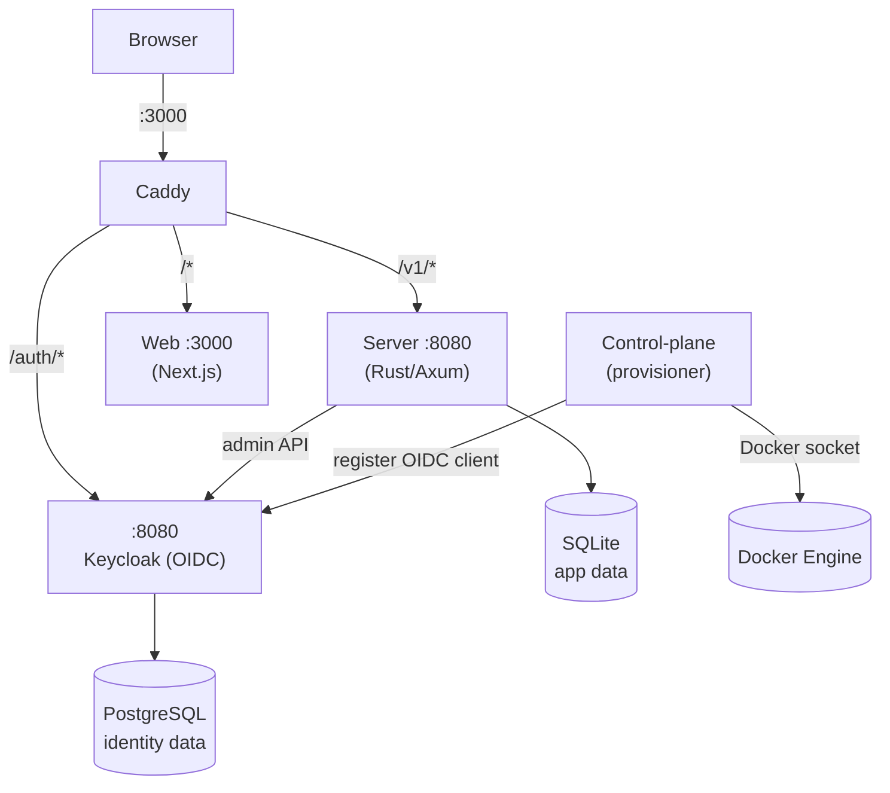

# Keasy

Federated workspace management platform — connect data, build catalogs, share datasets.

Built with Rust, Next.js, Keycloak, and Docker.

## Prerequisites

- [Docker](https://docs.docker.com/get-docker/) with Compose v2
- 8 GB RAM recommended (Keycloak + Rust compilation)

## Quick Start

```bash
git clone <repo-url> && cd keasy
make setup        # creates .env, builds images, starts everything
```

Open [http://localhost:3000](http://localhost:3000) — you'll be redirected to Keycloak login.

## Demo Credentials

The Keycloak realm import ships two demo users:

| Email | Password | Role |
|-------|----------|------|
| `owner@keasy.dev` | `owner` | Owner |
| `member@keasy.dev` | `member` | Member |

## Workspace Bootstrap

There are no SQL seeds. A workspace exists if and only if the **control-plane**
provisioner created it (`POST /workspaces { name, owner_keycloak_sub }`), which
registers the OIDC client in the shared Keycloak and brings up the instance
stack. Each instance, at boot, idempotently ensures the `owner` membership of
the `KEASY_OWNER_KEYCLOAK_SUB` it receives via config — the single bootstrap
datum. In dev, `make dev` pins the demo owner's Keycloak `sub` so the instance
self-provisions its owner; everything else starts empty.

## Architecture



## Tech Stack

| Component | Technology |
|-----------|-----------|
| Frontend | Next.js, React, shadcn/ui, TailwindCSS |
| Backend | Rust, Axum, SQLite |
| Identity | Keycloak (OIDC) |
| Reverse Proxy | Caddy |

## Development

```bash
make dev              # start dev environment with hot reload
make logs-server      # tail server logs
make logs-web         # tail web logs
make shell-server     # interactive shell in server container
make shell-web        # interactive shell in web container
```

- Editing `web/src/` triggers instant HMR in the browser
- Editing `server/src/` triggers cargo-watch recompilation and server restart

## Make Targets

| Target | Description |
|--------|-------------|
| `make help` | Show all available targets |
| `make setup` | First-time setup: create .env, build, start |
| `make dev` | Start dev environment (hot reload + demo data) |
| `make down` | Stop all services |
| `make prod` | Start with production builds (local test) |
| `make build` | Build production images without starting |
| `make logs` | Tail all service logs |
| `make logs-<svc>` | Tail logs for one service |
| `make restart` | Restart all services |
| `make restart-<svc>` | Restart one service |
| `make clean` | Nuclear reset: remove containers, volumes, images |
| `make shell-<svc>` | Open shell in container |
| `make ps` | Show running services |

## Project Structure

```
keasy/
├── infra/                          # Infrastructure configs
│   ├── caddy/Caddyfile             #   reverse proxy routing
│   ├── keycloak/realm-import/      #   OIDC realm + demo users
├── keycloak/                       # keasy-keycloak — shared Keycloak admin client
├── control-plane/                  # workspace provisioner (Docker API + Keycloak)
├── server/                         # Rust API server
│   ├── Dockerfile                  #   production (multi-stage, slim)
│   ├── Dockerfile.dev              #   development (cargo-watch)
│   └── src/
├── web/                            # Next.js frontend
│   ├── Dockerfile                  #   production (standalone)
│   ├── Dockerfile.dev              #   development (HMR)
│   └── src/
├── docker-compose.yml              # Base: all services, shared config
├── docker-compose.dev.yml          # Dev overlay: hot reload, seed
├── docker-compose.prod.yml         # Prod overlay: optimized builds
├── Makefile                        # Task runner
└── .env.example                    # Environment template
```

## OpenAPI Pipeline

The server is the single source of truth for the API schema. It exposes `GET /openapi.json` at runtime, generated from `#[utoipa]` annotations in Rust. The frontend consumes this to produce typed client code.

```
server (utoipa annotations)
  → GET /openapi.json          # served by the running server
  → openapi.json               # committed at repo root
  → npm run openapi            # generates web/src/lib/api/schema.d.ts
  → openapi-fetch client       # fully typed API calls in the frontend
```

To regenerate after changing server endpoints:

```bash
# 1. With the server running (make dev):
curl -s http://localhost:3000/v1/openapi.json | jq . > openapi.json

# 2. Regenerate TypeScript types:
cd web && npm run openapi
```

## Docker Compose Layering

The compose setup uses a base + overlay pattern:

- **`docker-compose.yml`** — defines all services, networks, volumes, and shared environment. Never used alone.
- **`docker-compose.dev.yml`** — adds hot reload (cargo-watch, Next.js HMR), dev seed data, relaxed healthchecks, and volume mounts for source code.
- **`docker-compose.prod.yml`** — uses optimized multi-stage builds, no seed data, and strict healthchecks.

```bash
# Dev (via Makefile)
make dev

# Production (via Makefile)
make prod

# Manual
docker compose -f docker-compose.yml -f docker-compose.dev.yml up --build
docker compose -f docker-compose.yml -f docker-compose.prod.yml up --build
```

## Environment Variables

| Variable | Description | Default |
|----------|-------------|---------|
| `KEASY_SECRET_KEY` | Encryption key for stored secrets | `change-me-in-production` |
| `KC_DB_PASSWORD` | Keycloak PostgreSQL password | `changeme` |
| `KC_ADMIN_PASSWORD` | Keycloak admin console password | `changeme` |
| `KEASY_OIDC_CLIENT_SECRET` | OIDC client secret (shared with Keycloak) | `keasy-dev-secret` |

## Production

Test production builds locally:

```bash
make prod         # build and run production images
make build        # build images without starting
```

## Troubleshooting

| Problem | Solution |
|---------|----------|
| Keycloak slow to start | Wait for healthcheck (up to 60s on first start) |
| Server compilation slow | First Rust build caches deps (~2-5 min), subsequent builds are fast |
| Hot reload not working | Check volume mounts; try `make restart-web` or `make restart-server` |
| Port 3000 in use | Run `make down` first, or change port in docker-compose.yml |
| Database issues | Run `make clean && make dev` to wipe and re-create demo data |
