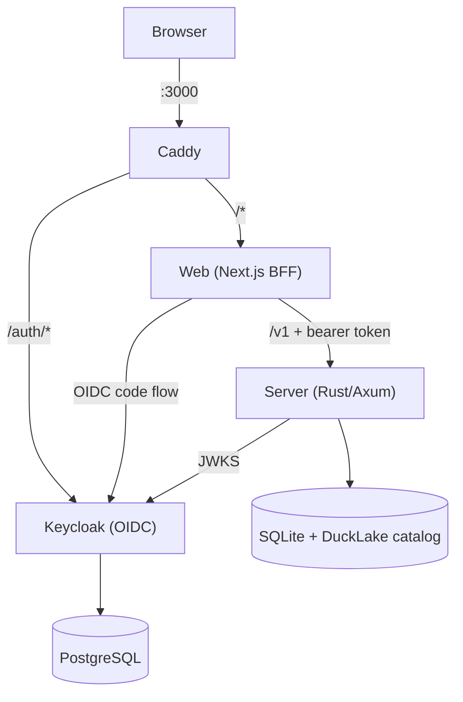

# Keasy

Federated workspace management platform — connect data, build catalogs, share datasets.

## Quick start

Needs Docker with Compose v2 and ~8 GB RAM (Keycloak + the first Rust compile).

```bash
make dev
```

Open [http://localhost:3000](http://localhost:3000) and log in at Keycloak. The first
`up` compiles the server's dependencies once; later ones reuse the cached volumes.

## Dev accounts

Two accounts, because the planes are disjoint: an owner administers members,
identity and the catalog and has no data plane; a member runs jobs, holds the
connections and opens Discovery, and administers nothing.

| Email | Password | Role | What it reaches |
|-------|----------|------|-----------------|
| `dev@keasy.local` | `password` | Member | Jobs, connections, Discovery, AI |
| `owner@keasy.local` | `password` | Owner | Members, identity, catalog |

Both are declared in `infra/terraform/realm/dev.tfvars` (`tenants`,
`dev_user_password`). Dev has no upstream IdP; prod has no passwords, only SSO.

## Dev data

`make dev` also brings up MinIO, dev-only:

| What | Where |
|------|-------|
| S3 API | `http://minio.localhost:9000` (and `http://localhost:9000`) |
| Console | [http://localhost:9001](http://localhost:9001) |
| Credentials | `minioadmin` / `minioadmin` |
| Bucket | `keasy-dev`, seeded from `infra/dev/seed/` on every `up` |

At boot the instance declares, over that bucket, the **MinIO dev bucket** source
connection, the **MinIO dev shapes** vocabulary connection (`vocab/`), the sink
(`output/`), and a draft job, **Shop orders**, from `infra/dev/shop.fossil`. A
member opens the workspace with data, shapes, a destination and a job ready to
launch. Access is proved before each connection row is written, and an existing
sink is never overwritten.

`minio.localhost` is load-bearing: Docker's DNS answers it inside the compose
network and `*.localhost` is loopback on the host, so a URL the server presigns
is one the browser can fetch.

## Architecture


```mermaid
graph TD
    Browser -->|":3000"| Caddy
    Caddy -->|"/auth/*"| Keycloak["Keycloak (OIDC)"]
    Caddy -->|"/*"| Web["Web (Next.js BFF)"]
    Web -->|"/v1 + bearer token"| Server["Server (Rust/Axum)"]
    Web -->|"OIDC code flow"| Keycloak
    Server -->|"JWKS"| Keycloak
    Server --> SQLite[("SQLite + DuckLake catalog")]
    Keycloak --> PostgreSQL[("PostgreSQL")]
```

Authentication is a Backend For Frontend. The **web** is the OIDC relying party
(`@kanzo-tech/auth/next`, mounted at `/api/auth`): it holds the confidential
client, keeps the tokens, and gives the browser a sealed cookie it cannot read.
The **server** is a resource server: it validates the bearer token against the
realm's JWKS (`iss`, `aud`, `exp`, `azp`, signature) and holds no client secret,
no session and no cookie. `/v1` reaches it only through the web.

Mappings run in the browser (DuckDB-WASM + `@fossil-lang/*`); the server hosts
connections, signed URLs, jobs and the catalog.

## Deployment

Docker Swarm, driven by Terraform — see [`infra/terraform/README.md`](infra/terraform/README.md).
`make deploy-platform` brings up Traefik, Keycloak and Postgres; `make deploy-realm`
applies the realm and one server + web stack per tenant declared in
`realm/terraform.tfvars`. Images are published to GHCR by `.github/workflows/images.yml`
on `v*` tags, after the server and web CI pass.

`make prod` builds and runs the release Dockerfiles locally, with the dev identity.
It is not a deployment.

## Development

| Target | What it does |
|--------|--------------|
| `make dev` | Start dev; rebuild only after dep or Dockerfile changes (code hot-reloads) |
| `make down` | Stop everything |
| `make clean` | Remove containers, volumes (Keycloak, dev realm state, data) and images |
| `make logs` / `make logs-<svc>` | Tail logs |
| `make restart` / `make restart-<svc>` | Restart without rebuilding |
| `make shell-<svc>` | Shell in a container |
| `make prod` / `make build` | Run / build the release images |

Compose is a base file plus an overlay: `docker-compose.dev.yml` (hot reload,
MinIO, seed) or `docker-compose.prod.yml` (release images). Every setting has its
default in compose as `${VAR:-default}`; export a variable to override it.

## OpenAPI

The server's `#[utoipa]` annotations are the schema; the web generates its types
from the committed `openapi.json`.

```bash
cd server && cargo run --quiet --bin openapi   # writes ../openapi.json
cd web && pnpm run openapi                     # writes src/lib/api/schema.d.ts
```

## Layout

```
infra/caddy/        the local edge (/auth → Keycloak, everything else → web)
infra/dev/          MinIO seed and the draft job, dev-only
infra/terraform/    platform/ and realm/ — the Swarm deployment, and dev's realm
server/             Rust API (Dockerfile = release, Dockerfile.dev = cargo-watch)
web/                Next.js app and BFF (Dockerfile = release, Dockerfile.dev = HMR)
```
