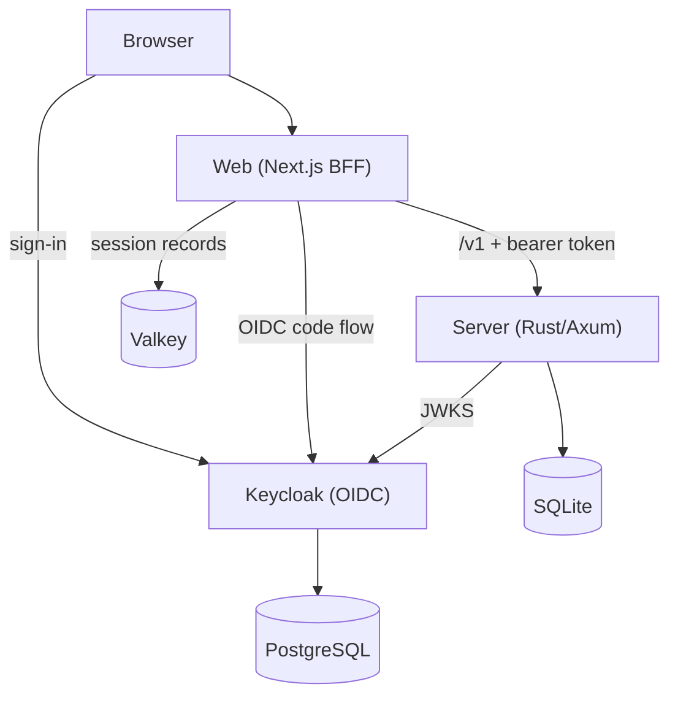

# Keasy

Federated workspace management platform — connect data, build catalogs, share datasets.

## Quick start

Needs Docker with Compose v2 and ~8 GB RAM (Keycloak + the first Rust compile).

```bash
make dev
```

Open [http://localhost:3000](http://localhost:3000) and log in at Keycloak. The first
`up` compiles the server's dependencies once; later ones reuse the cached volumes.
No `.env`: every dev value is a literal in `docker-compose.yml`.

| What | Where |
|------|-------|
| App (web BFF, `/api/v1`) | [http://localhost:3000](http://localhost:3000) |
| Keycloak | [http://keycloak.localhost:8180](http://keycloak.localhost:8180) (admin `admin` / `admin`) |
| API, for curl | `http://localhost:8080` |

## Dev accounts

Two accounts, because the planes are disjoint: an owner administers members,
identity and the catalog and has no data plane; a member runs jobs, holds the
connections and opens Discovery, and administers nothing.

| Email | Password | Role | What it reaches |
|-------|----------|------|-----------------|
| `dev@keasy.local` | `password` | Member | Jobs, connections, Discovery, AI |
| `owner@keasy.local` | `password` | Owner | Members, identity, catalog |

Both are declared in `infra/terraform/realm/dev.tfvars` (`tenants`,
`dev_user_password`). Dev has no upstream IdP; prod has no passwords, only SSO.

## Dev data

`make dev` also brings up MinIO, dev-only:

| What | Where |
|------|-------|
| S3 API | `http://minio.localhost:9000` (and `http://localhost:9000`) |
| Console | [http://localhost:9001](http://localhost:9001) |
| Credentials | `minioadmin` / `minioadmin` |
| Bucket | `keasy-dev`, seeded from `infra/dev/seed/` on every `up` |

At boot the instance declares, over that bucket, the **MinIO dev bucket** source
connection, the **MinIO dev shapes** vocabulary connection (`vocab/`), the sink
(`output/`). Access is proved before each connection row is written, and an
existing sink is never overwritten. `infra/dev/shop.fossil` is a program over
those two connections, ready to paste into a new job.

`minio.localhost` and `keycloak.localhost` are load-bearing: Docker's DNS answers
them inside the compose network and `*.localhost` is loopback on the host, so a
URL the server presigns, and the issuer a token names, work from both sides.

## Architecture


```mermaid
graph TD
    Browser --> Web["Web (Next.js BFF)"]
    Browser -->|"sign-in"| Keycloak["Keycloak (OIDC)"]
    Web -->|"/v1 + bearer token"| Server["Server (Rust/Axum)"]
    Web -->|"OIDC code flow"| Keycloak
    Web -->|"session records"| Valkey[("Valkey")]
    Server -->|"JWKS"| Keycloak
    Server --> SQLite[("SQLite")]
    Keycloak --> PostgreSQL[("PostgreSQL")]
```

Authentication is a Backend For Frontend. The **web** is the OIDC relying party
(`@kanzo-tech/auth/next`, mounted at `/api/auth`): it holds the confidential
client, keeps the tokens in Valkey (`KEASY_SESSION_STORE_URL`), and gives the
browser a sealed cookie carrying only the ticket to them.
The **server** is a resource server: it validates the bearer token against the
realm's JWKS (`iss`, `aud`, `exp`, `azp`, signature) and holds no client secret,
no session and no cookie. It is reached only through the web's `/api/v1`.

Mappings run in the browser (DuckDB-WASM + `@fossil-lang/*`), and so does source
introspection; the server hosts connections, signed URLs, jobs and the catalog,
and never reads a data file. Every job names a sink as its destination and is
visible only to the member who created it.

Stored credentials are sealed with `KEASY_SECRET_KEY`: 32 random bytes in base64
(`openssl rand -base64 32`). The server refuses to start without one, and refuses
a database whose schema is not the one it ships — there are no migrations; wipe
the volume (`make clean`) instead.

## Deployment

Docker Swarm, driven by Terraform — see [`infra/terraform/README.md`](infra/terraform/README.md).
`make deploy-platform` brings up Traefik, Keycloak (on its own host) and Postgres;
`make deploy-realm` applies the realm and one server + web + Valkey stack per tenant
declared in `realm/terraform.tfvars`. Images are published to GHCR by
`.github/workflows/images.yml` on `v*` tags, after the server and web CI pass.

## Development

| Target | What it does |
|--------|--------------|
| `make dev` | Start dev; rebuild only after dep or Dockerfile changes (code hot-reloads) |
| `make down` | Stop everything |
| `make clean` | Remove containers, volumes (Keycloak, dev realm state, data) and images |
| `make logs` / `make logs-<svc>` | Tail logs |
| `make restart` / `make restart-<svc>` | Restart without rebuilding |
| `make shell-<svc>` | Shell in a container |

`docker-compose.yml` is the dev stack and nothing else. Dev applies the same
`infra/terraform/realm` module as prod, with `dev.tfvars`.
The Rust toolchain is pinned once, in `server/rust-toolchain.toml`.

## API contract

The wire types live in `server/crates/keasy-api`; each server module's
`routes::router()` is both its routes and their spec. `api/` (`@keasy/api`) holds
the committed `openapi.json`, the types generated from it and the client the web
uses. CI fails when they are stale.

```bash
make api   # api/openapi.json + api/src/schema.d.ts
```

## Layout

```
api/                @keasy/api: the committed spec, its generated types and the client
infra/dev/          MinIO seed and an example program, dev-only
infra/terraform/    platform/ and realm/ — the Swarm deployment, and dev's realm
server/             Rust API (Dockerfile = release, Dockerfile.dev = cargo-watch)
web/                Next.js app and BFF (Dockerfile = release, Dockerfile.dev = HMR)
```
