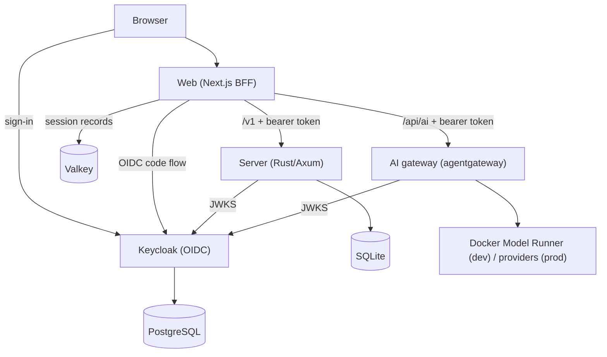

# Keasy

Federated workspace management platform — connect data, build catalogs, share datasets.

## Quick start

Needs Docker with Compose v2.20+ and ~8 GB RAM (Keycloak + the first Rust compile).

```bash
make dev
```

`make dev` brings everything up and returns when the web answers: open
[http://acme.localhost:3000](http://acme.localhost:3000) and log in at Keycloak. The first one takes
a while — it compiles the server's dependencies and the web's first pages, and pulls the local
models — and later ones reuse the cached volumes. The platform services, identity and the AI
gateway, are kanzo-ui's, included by URL at `KANZO_UI_REF`; nothing is checked out.

Every dev value is a literal in `compose.yaml` and `compose.override.yaml`, and a local `.env`
overrides any of them ([`.env.example`](.env.example)). Anything past `make dev` is plain
`docker compose`, which reads the development files on its own: `docker compose logs -f web`,
`docker compose restart acme-server`, `docker compose exec web sh`, `docker compose down`.

| What | Where |
|------|-------|
| App (web BFF, `/api/v1` and `/api/ai`) | [http://acme.localhost:3000](http://acme.localhost:3000) — one web, each organization at its subdomain |
| Keycloak | [http://localhost:8080](http://localhost:8080) (admin `admin` / `admin`) |
| API, for curl | `http://localhost:8081` |
| AI gateway | `http://localhost:4000` — a token the realm issued for `ai-gateway` and one organization is its only credential; every request is logged to `ai-postgres` |

### AI in development

By default both aliases run on local models served by Docker Model Runner (Docker Desktop 4.40+,
`docker desktop enable model-runner`), on the host's GPU: `chat` on an 8B model, `complete` on a 3B.
`make dev` pulls them the first time (~6.5 GB) and runs them with an 8192-token context, which fits
a 16 GB laptop; until they are pulled everything but AI works. To use a provider instead — no
download, any laptop — name it in `.env`:

```sh
AI_CHAT=anthropic/claude-sonnet-5-5
AI_COMPLETE=anthropic/claude-haiku-4-5
ANTHROPIC_API_KEY=sk-ant-…
```

`provider/model`, with the provider's usual key: `anthropic`, `openai`, `gemini`, `mistral`,
`openrouter`, or `local` for Docker Model Runner. The same two variables choose the models in a
deployment ([Deployment](#deployment)). When an alias fails, Ask says why — the gateway's status and
reason (`ai/unavailable`) — rather than a timeout.

## Dev accounts

The platform's seed users (kanzo-ui `services/auth/seed`), all with password `password`.
This instance serves the `acme` organization. A role comes from the organization group
the user is in, which the seed maps onto keasy's roles (`infra/dev/roles.yaml`):

| User | acme (this instance) | globex | What it shows |
|------|----------------------|--------|---------------|
| `ana` | admin (*Admins*) | reader (*Readers*) | everything; the switcher between two organizations |
| `bruno` | editor (*Data team*) | — | builds graphs, connections and secrets; changes what he made |
| `eva` | reader (*Analysts*) | — | reads graphs, outputs and connections; creates nothing |
| `fede` | member, no group | — | signed in, no role here: the forbidden page |
| `carla` | — | admin (*Platform*) | a member of another organization only: no role here |
| `dan` | — | — | no organization at all |

Roles nest: reader ⊂ editor ⊂ admin, composites in keasy's declaration (`compose.yaml`,
`x-application`), so a token carries the expanded set. Prod has no seed: people are invited into their organization from Keycloak,
and its admin maps keasy's roles onto the organization's groups.

## Dev data

`make dev` also brings up an S3 store, dev-only: [SeaweedFS](https://github.com/seaweedfs/seaweedfs),
configured by `infra/dev/seaweedfs/` (its keys in `s3.json`, and in `iam.json` the role
the server assumes to vend a credential scoped to one prefix). It has no console.

| What | Where |
|------|-------|
| S3 API (and STS) | `http://s3.localhost:9000` (and `http://localhost:9000`) |
| Credentials | `keasy-admin` / `keasy-admin-secret` |
| Bucket | `keasy-dev`, seeded from `infra/dev/examples/` on every `up` |

The dev graph is the [LDBC Social Network Benchmark](https://ldbcouncil.org/benchmarks/snb/)
at scale factor 0.1 — the official Interactive v1 `CsvCompositeMergeForeign` archive
(about 17 MB compressed, 59 MB of CSV: 1.5k people, 136k posts, 151k comments). It is
not in git; fetch it once, before `make dev`:

```bash
make seed   # downloads, checks the SHA-256s, unpacks into infra/dev/examples/<name>/data/
```

The same `make seed` fetches a second, geographic graph: [OpenFlights](https://openflights.org/data)
airports and routes, pinned to one upstream commit and its SHA-256s, and cut down to the 3,218
airports some direct route touches and the 36,906 directed routes between them (700 KB of CSV, needs
`python3`). Every airport carries numeric `lat` and `lon` in WGS 84 degrees, so Discover's Map
placement (x = `lon`, y = `lat`) draws it as a map. The data is © OpenFlights under the
[ODbL](https://opendatacommons.org/licenses/odbl/1-0/) — `infra/dev/examples/openflights/data/NOTICE` is the
attribution, and it travels to the bucket with the files. It is derived on your machine and not
committed: the subset's own digest is pinned, so every machine derives the same bytes.

A third is public funding: [CORDIS](https://cordis.europa.eu)'s Horizon Europe projects, the
organisations in them and what each was granted, from the Publications Office's CSV export of
2026-08-06 (37 MB zipped; CORDIS replaces the file in place, so the pin is the Internet Archive's
capture of it). It is cut down to about 18 MB of CSV: 23,451 projects, 35,122 organisations, the
145,274 participations between them, and the 2,767 call topics and 15 programme parts the projects
answer.
A participation is a vertex of its own, EURIO's `OrganisationRole`, as the role and the EU
contribution belong to it; the shapes are EURIO's, the Publications Office's ontology of CORDIS,
where it has a term. Organisations carry `lat` and `lon` where CORDIS has a position. The data is
© European Union under [CC BY 4.0](https://creativecommons.org/licenses/by/4.0/) —
`infra/dev/examples/cordis/data/NOTICE` is the attribution — and, like OpenFlights, derived on your
machine to pinned digests.

And a fourth, whose time is on a relation: the [Nobel laureates](https://www.nobelprize.org/about/developer-zone-2/)
and every prize awarded to 2025, from nobelprize.org's API (CC0), derived into six JSON files
(470 KB, needs `python3`). Each prize a laureate won is a vertex between the laureate and the
category — the API's own Linked Data vocabulary models it so, as `nobel:LaureateAward` — and it
carries its year as an `xsd:gYear`, so a timeline over it plays the prizes forward and greys the
edges into the years it leaves out. The API is live, so the download is not pinned and the
derivation is: prizes to 2025, every list sorted, the digests of the six files; a correction
upstream fails `make seed` rather than changing the graph. `infra/dev/examples/nobel/data/NOTICE`
names the source.

Without them the bucket holds the shapes alone and `s3-init` says to run `make seed`.
The failure scenarios do not need it: `s3-init` also mirrors the suite's own
fixtures (`e2e/fixtures/`, a small shop: people, orders and `shop.shex`) to `e2e/`,
and the suite declares its connections over them (**E2E source**, **E2E shapes**) as
it signs in. The smoke (`e2e/smoke/`) does: it runs each example's program over its seed
and drives Discovery through them, so `make e2e` fetches them first, as CI does.

Each example is one folder under `infra/dev/examples/<name>/`: `fetch.sh` (what `make seed` runs
for it), `shapes.shex`, `mapping.fossil` and the gitignored `data/` it fetches. In the bucket it is
`examples/<name>/data/` and `examples/<name>/shapes/`. At boot the instance declares, over them, a
data source and a vocabulary connection per example — **LDBC SNB** and **LDBC SNB shapes**,
**OpenFlights** and **OpenFlights shapes**, **CORDIS** and **CORDIS shapes**, **Nobel laureates**
and **Nobel laureates shapes** — and the sink, **Workspace output** (`output/`). Access is proved
before each connection row is written, and an existing sink is never overwritten. Each example's
program reads its own two connections; paste one into the studio to map its graph into `output/`:

| Program | Graph |
|---------|-------|
| `infra/dev/examples/snb/mapping.fossil` | LDBC SNB SF0.1 onto its `shapes.shex` |
| `infra/dev/examples/openflights/mapping.fossil` | OpenFlights onto its `shapes.shex`: 3,218 `Airport` vertices with `lat`/`lon`, 36,906 `routeTo` edges |
| `infra/dev/examples/cordis/mapping.fossil` | CORDIS onto its `shapes.shex` (EURIO): 206,629 vertices — 23,451 `Project`, 35,122 `Organisation`, 145,274 `OrganisationRole`, 2,782 `FundingScheme` — and 316,766 edges |
| `infra/dev/examples/nobel/mapping.fossil` | The Nobel laureates onto its `shapes.shex`: 1,018 `Laureate`, 1,026 `LaureateAward` with their year as `xsd:gYear`, 6 `Category`, 379 `University`, 86 `Country` |

`infra/dev/examples/openflights/rules.ttl` is rules for the OpenFlights graph: a SHACL shapes graph
to drop on the graph's Rules panel in Discover. Most airports conform; 44 fail it (no IATA code, or
an ICAO field that is not a four-letter ICAO code), and two kinds draw a warning: 29 with no time
zone and 218 above 4,000 ft, where takeoff performance is limited.

`infra/dev/examples/cordis/rules.ttl` is the same for the CORDIS graph. It finds 5 organisations
with no country, one with two, and 356 participations that do not say whether the organisation is an
SME; and it warns about 12,525 projects that declare a total cost of 0, 1,675 organisations with no
position, and 3,164 participations that have ended.

**A stack seeded before the examples moved** (when they were `infra/dev/seed/` and `snb.fossil`,
`geo.fossil` at `infra/dev/`) keeps its old connections. The instance declares a connection only when
none of that name exists, so **LDBC SNB** and **OpenFlights** still point at `ldbc/` and `geo/`, and
**Dev shapes** stays in the list. Wipe the volume (`docker compose down -v`), run `make seed` and
`make dev` again, and delete the old `infra/dev/seed/` folder, which nothing ignores any more.

`s3.localhost` is load-bearing: Docker's DNS answers it inside the compose network
and `*.localhost` is loopback on the host, so the endpoint the server is given
(`AWS_ENDPOINT_URL_S3`, and the vended credential names) works from both sides. The issuer is `http://localhost:8080/realms/kanzo`, the one the
browser sees; the server and the BFF fetch its keys at `http://keycloak:8080`
(`KEASY_OIDC_INTERNAL_BASE_URL`).

## Architecture


```mermaid
graph TD
    Browser --> Web["Web (Next.js BFF)"]
    Browser -->|"sign-in"| Keycloak["Keycloak (OIDC)"]
    Web -->|"/v1 + bearer token"| Server["Server (Rust/Axum)"]
    Web -->|"OIDC code flow"| Keycloak
    Web -->|"session records"| Valkey[("Valkey")]
    Server -->|"JWKS"| Keycloak
    Server --> SQLite[("SQLite")]
    Web -->|"/api/ai + bearer token"| Gateway["AI gateway (agentgateway)"]
    Gateway -->|"JWKS"| Keycloak
    Gateway --> Models["Docker Model Runner (dev) / providers (prod)"]
    Keycloak --> PostgreSQL[("PostgreSQL")]
```

Authentication is a Backend For Frontend. The **web** is the OIDC relying party
(`@kanzo-tech/auth/next`, mounted at `/api/auth`): it holds the confidential
client, keeps the tokens in Valkey (`KEASY_SESSION_STORE_URL`), and gives the
browser a sealed cookie carrying only the ticket to them. Its proxy is the session's
authority on every page: it renews the tokens in place before they lapse, ends a session
Keycloak refused, and sends a navigation without one to sign in and back to the page it
asked for. **One web serves every organization** — Keycloak's Organizations model, one
`keasy` client for all of them: the organization is the host's subdomain
(`<alias>.<KEASY_BASE_DOMAIN>`), the session carries every membership (which is what the
workspace switcher lists), and a sign-out at Keycloak reaches the web through one
back-channel logout URL. The **server** is per organization, and so is its data: it is a
resource server that validates the bearer token against the realm's JWKS (`iss`, `aud`,
`exp`, `azp`, signature) and holds no client secret, no session and no cookie. The web
forwards `/api/v1` to the server of the organization the request addresses
(`KEASY_API_URL`, with `{tenant}` standing for its alias).

Mappings run in the browser (DuckDB-WASM + `@fossil-lang/*`), and so does source
introspection; the server hosts connections, vends credentials scoped to one prefix, graphs and the catalog,
and never reads a data file. Every graph names a sink as its destination. The work
is shared: everyone in the workspace reads every graph, every editor runs it, and its
owner or an admin changes it (roles `reader ⊂ editor ⊂ admin`, from the Keycloak
organization the instance serves; the matrix is `docs/design/permissions.md`).

Models are not a credential. Every call goes to the platform's **AI gateway**
(kanzo-ui's `services/ai`, agentgateway) under an alias (`chat`, `complete`), never a
provider. The web forwards `/api/ai` to it (`KEASY_AI_URL`) as it forwards `/api/v1`, with
the session's token exchanged for the `ai-gateway` audience and the organization the request
addresses: that token is the gateway's only credential and names the organization it charges.
No server holds a model key. Which model answers each alias, the providers' keys and the budget are
the gateway's environment: `AI_CHAT` and `AI_COMPLETE`, in `.env` in development and in
`infra/prod/prod.env` in a deployment.

A **credential** (S3 or Azure) is who keasy is when it reaches a store; a
**connection** puts one to use (a storage prefix — a source or the one sink). Both
are validated on every write,
and a credential in use cannot be deleted. `KEASY_BOOTSTRAP_FILE` declares them at
boot in the API's own request format (dev: `infra/dev/bootstrap.json`).

An instance's look is declared, not edited: `KEASY_BRANDING_FILE` names a YAML
file holding exactly what kanzo-ui's theme generator exports (`branding:` with
`theme_css`, `families`, `default`, `lock`, and optionally `logo`), validated at
boot and served publicly at `GET /v1/branding`. Without it every shipped theme is
offered. Example: `infra/dev/branding.example.yml`; in a deployment, mounted from the
organization's file (`infra/prod/README.md`).

Stored credentials are sealed with `KEASY_SECRET_KEY`: 32 random bytes in base64
(`openssl rand -base64 32`). The server refuses to start without one, and refuses
a database whose schema is not the one it ships — there are no migrations; wipe
the volume (`make clean`) instead. The latest such change is the `rules` table (a
graph's SHACL rules): a stack started before it needs `docker compose down -v`.

## Deployment

The same compose files, on one server: `compose.yaml` with `compose.prod.yaml` — the platform as it
runs in production, Traefik with Let's Encrypt in front — and one file per organization in
`infra/prod/orgs/`. What a deployment says is versioned in `infra/prod/`: `prod.env` (the release,
the domain, the models) and `secrets.sops.env`, encrypted with SOPS and age to the keys of whoever
deploys. On the server:

```sh
git pull && make deploy
```

Changing a model, adding or removing an organization, moving to a new release: edit a line in
`infra/prod/`, commit, `make deploy`. [`infra/prod/README.md`](infra/prod/README.md) is the guide.
Images are published to GHCR by `.github/workflows/images.yml` on `v*` tags, after the server and
web CI pass.

## Development

| Target | What it does |
|--------|--------------|
| `make dev` | Start dev and wait until the web answers; again only after dep or Dockerfile changes (code hot-reloads) |
| `make seed` | Fetch the dev graphs, for the next `make dev` to upload |
| `make clean` | Remove containers, volumes (Keycloak, the realm's state, data) and images |
| `make e2e` | The failure scenarios and the smoke over the dev seeds (`e2e/`, Playwright) against the stack without the local models, as CI; main checkout only, as Keycloak admits :3000 alone |
| `make demo` | List the product demos; `DEMO=<name>` or `DEMO=all` records them (see [Demos](#demos)) |
| `make api` | Regenerate the API contract ([API contract](#api-contract)) |
| `make deploy`, `make secrets`, `make key` | A deployment ([`infra/prod/README.md`](infra/prod/README.md)) |

Everything else is `docker compose`, which reads `compose.yaml` and `compose.override.yaml` on its
own. The platform's release is `KANZO_UI_REF`, in the `include:` of `compose.override.yaml` and
`compose.prod.yaml`, and moves with `@kanzo-tech/*` in `web/package.json`; the Rust toolchain is
pinned once, in `server/rust-toolchain.toml`.

## Demos

Product demos are Playwright scripts in `e2e/demos/` that record a story and check each step of it, against
the stack `make dev` and `make seed` bring up on :3000 (main checkout only, as for `make e2e`).

```sh
make demo                          # list them: name and what each shows
make demo DEMO=snb-explore         # record one, light and dark
make demo DEMO=all THEME=dark      # every demo, one side
```

Each lands in `e2e/demos/out/` as `<demo>-<theme>.mp4` (H.264, 1600×900), `<demo>-<theme>.png`
(the poster) and `<demo>-<theme>.chapters.json` (each subtitle and when it shows), gitignored.
The viewport is 1600×900 so the app's text reads once the video sits in a page. It needs `ffmpeg` on PATH (`brew install ffmpeg`), which turns
Playwright's frames into the MP4. The demos project runs Chromium on the GPU (Metal on a Mac,
`playwright.config.ts`), which the Graph view needs: in software it paints at a frame or two a second.

`make demo` touches no container for a graph demo: Next's dev indicator and React Query's devtools
are hidden in the recording's browser. A demo that asks the model (`snb-ask`) swaps the AI gateway onto
`e2e/demos/models.yml` for the recording and puts the dev models back after. Its model is replayed by
default, from `e2e/demos/recordings/snb-ask.json`: the model's words are the recording's, and the tool
it calls still runs on the page, so the figures on screen are the corpus's. `LIVE=1` asks the model
instead, and `make demo DEMO=snb-ask LIVE=1 RECORD=1` captures a new recording, written only once every
check of the take has passed (`e2e/demos/record/model.ts`).

**Adding a demo** is a file `e2e/demos/<name>.demo.ts` calling `demo(name, description, { arrange,
steps })` from `e2e/demos/record/`, transcribed from its table in `e2e/demos/STORYBOARD.md`; `make demo`
lists it from that title. `arrange` gets the page ready off camera (`seedGraph` from
`e2e/support/seeds.ts`, with `reuse`, finds or runs a dev example's graph) and gets the page and its
`@kanzo-tech/testing` environment, made before the page loads. Each step is a **subtitle**, an
**action** — a call on keasy's page objects (`e2e/support/app/`) or the library's harnesses, brushes
and lassos in data — and a **check**, so a take whose page did something else fails rather than
recording it; `poster: true` takes the still after a step. No title cards. The subtitle leads its step
and stays up for its reading time (`hold`, the only wait on a clock, and the viewer's). The cursor is the
page's own (`e2e/demos/record/cursor.ts`): an overlay injected into the recording's browser that
follows the real pointer events, glides to each target before the action lands and rings where a
button goes down; while a demo records, every click, hover, fill (typed) and `page.mouse` gesture waits
out that glide, so the cursor arrives before the page answers. `snb-explore.demo.ts` is the worked
example. A demo whose example or feature is not on main yet says so in `skip`, and is listed but skipped.

## API contract

The wire types live next to what they describe in `server/src`; each route
module's `router()` is both its routes and their spec. `api/` (`@keasy/api`) holds
the committed `openapi.json`, the types generated from it and the client the web
uses. `server/tests/api/openapi.rs` is a golden test of `openapi.json`, so
`cargo test` (and CI) fails when it is stale.

```bash
make api   # UPDATE_EXPECT=1 cargo test --test api openapi, then pnpm generate
```

## Layout

```
api/                @keasy/api: the committed spec, its generated types and the client
e2e/                @keasy/e2e: one Playwright test per failure scenario, the smoke over the dev seeds, its fixtures, and the `faults` profile's servers
compose.yaml        keasy as it runs anywhere: the web, its sessions, its declaration in the realm
compose.server.yaml one organization's server, which each organization's file extends
compose.override.yaml  development: the platform in its dev shape, builds, the S3 store, the faults
compose.prod.yaml   a deployment: the platform as deployed, Traefik, secrets from the environment
infra/dev/          development's organization, secrets, roles, S3 config and seed examples
infra/prod/         a deployment's values: prod.env, orgs/, secrets.sops.env, and its guide
server/             Rust API (Dockerfile = release, Dockerfile.dev = cargo-watch)
  src/main.rs       configures from the environment and serves
  src/startup.rs    Application, AppState, the router and the spec it publishes
  src/routes/       one file per resource: handlers with their bodies
  src/domain/       the records and parse-don't-validate types
  src/{credentials,connections,graphs}/  persistence and shared behaviour
  tests/api/        black-box HTTP tests through spawn_app, and the spec golden
web/                Next.js app and BFF (Dockerfile = release, Dockerfile.dev = HMR)
```
