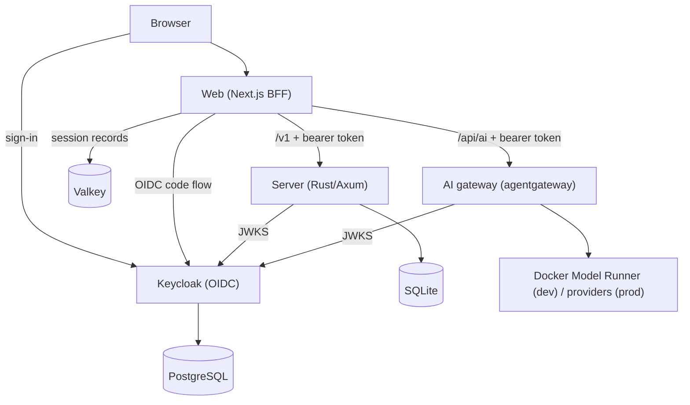

# Keasy

Federated workspace management platform — connect data, build catalogs, share datasets.

## Quick start

Needs Docker with Compose v2 and ~8 GB RAM (Keycloak + the first Rust compile).

```bash
make dev
```

`make dev` first runs `make deps` (kanzo-ui's platform services, identity and the AI
gateway, checked out into `.deps/kanzo-ui`). Open [http://acme.localhost:3000](http://acme.localhost:3000)
and log in at Keycloak. The first
`up` compiles the server's dependencies once; later ones reuse the cached volumes.
Every dev value is a literal in `docker-compose.yml`; a local `.env` overrides the
included services' variables (e.g. `KC_ADMIN_PASSWORD`), and `provision` follows it.

| What | Where |
|------|-------|
| App (web BFF, `/api/v1` and `/api/ai`) | [http://acme.localhost:3000](http://acme.localhost:3000) — one web, each organization at its subdomain |
| Keycloak | [http://localhost:8080](http://localhost:8080) (admin `admin` / `admin`) |
| API, for curl | `http://localhost:8081` |
| AI gateway | `http://localhost:4000` — a token the realm issued for `ai-gateway` and one organization is its only credential; every request is logged to `ai-postgres` |

AI runs on local models served by Docker Model Runner (Docker Desktop 4.40+,
`docker desktop enable model-runner`): native on the host, on the Mac's GPU. The first `up`
pulls them; until then everything but AI works.

## Dev accounts

The platform's seed users (kanzo-ui `services/auth/seed`), all with password `password`.
This instance serves the `acme` organization. A role comes from the organization group
the user is in, which `provision` maps onto keasy's roles (`infra/auth/dev-roles.sh`):

| User | acme (this instance) | globex | What it shows |
|------|----------------------|--------|---------------|
| `ana` | admin (*Admins*) | reader (*Readers*) | everything; the switcher between two organizations |
| `bruno` | editor (*Data team*) | — | builds graphs, connections and secrets; changes what he made |
| `eva` | reader (*Analysts*) | — | reads graphs, outputs and connections; creates nothing |
| `fede` | member, no group | — | signed in, no role here: the forbidden page |
| `carla` | — | admin (*Platform*) | a member of another organization only: no role here |
| `dan` | — | — | no organization at all |

Roles nest: reader ⊂ editor ⊂ admin, composites in `infra/auth`, so a token carries the
expanded set. Prod has no seed: people are invited into their organization from Keycloak,
and its admin maps keasy's roles onto the organization's groups.

## Dev data

`make dev` also brings up an S3 store, dev-only: [SeaweedFS](https://github.com/seaweedfs/seaweedfs),
configured by `infra/dev/seaweedfs/` (its keys in `s3.json`, and in `iam.json` the role
the server assumes to vend a credential scoped to one prefix). It has no console.

| What | Where |
|------|-------|
| S3 API (and STS) | `http://s3.localhost:9000` (and `http://localhost:9000`) |
| Credentials | `keasy-admin` / `keasy-admin-secret` |
| Bucket | `keasy-dev`, seeded from `infra/dev/examples/` on every `up` |

The dev graph is the [LDBC Social Network Benchmark](https://ldbcouncil.org/benchmarks/snb/)
at scale factor 0.1 — the official Interactive v1 `CsvCompositeMergeForeign` archive
(about 17 MB compressed, 59 MB of CSV: 1.5k people, 136k posts, 151k comments). It is
not in git; fetch it once, before `make dev`:

```bash
make seed   # downloads, checks the SHA-256s, unpacks into infra/dev/examples/snb/data/ and openflights/data/
```

The same `make seed` fetches a second, geographic graph: [OpenFlights](https://openflights.org/data)
airports and routes, pinned to one upstream commit and its SHA-256s, and cut down to the 3,218
airports some direct route touches and the 36,906 directed routes between them (700 KB of CSV, needs
`python3`). Every airport carries numeric `lat` and `lon` in WGS 84 degrees, so Discover's Map
placement (x = `lon`, y = `lat`) draws it as a map. The data is © OpenFlights under the
[ODbL](https://opendatacommons.org/licenses/odbl/1-0/) — `infra/dev/examples/openflights/data/NOTICE` is the
attribution, and it travels to the bucket with the files. It is derived on your machine and not
committed: the subset's own digest is pinned, so every machine derives the same bytes.

Without them the bucket holds the shapes alone and `s3-init` says to run `make seed`.
The failure scenarios do not need it: `s3-init` also mirrors the suite's own
fixtures (`e2e/fixtures/`, a small shop: people, orders and `shop.shex`) to `e2e/`,
and the suite declares its connections over them (**E2E source**, **E2E shapes**) as
it signs in. The smoke (`e2e/smoke/`) does: it runs both programs over these seeds and
drives Discovery through them, so `make e2e` fetches them first, as CI does.

Each example is one folder under `infra/dev/examples/<name>/`: `fetch.sh` (what `make seed` runs
for it), `shapes.shex`, `mapping.fossil` and the gitignored `data/` it fetches. In the bucket it is
`examples/<name>/data/` and `examples/<name>/shapes/`. At boot the instance declares, over them, a
data source and a vocabulary connection per example — **LDBC SNB** and **LDBC SNB shapes**,
**OpenFlights** and **OpenFlights shapes** — and the sink, **Workspace output** (`output/`). Access
is proved before each connection row is written, and an existing sink is never overwritten. Each
example's program reads its own two connections; paste one into the studio to map its graph into
`output/`:

| Program | Graph |
|---------|-------|
| `infra/dev/examples/snb/mapping.fossil` | LDBC SNB SF0.1 onto its `shapes.shex` |
| `infra/dev/examples/openflights/mapping.fossil` | OpenFlights onto its `shapes.shex`: 3,218 `Airport` vertices with `lat`/`lon`, 36,906 `routeTo` edges |

`infra/dev/examples/openflights/rules.ttl` is rules for the OpenFlights graph: a SHACL shapes graph
to drop on the graph's Rules panel in Discover. Most airports conform; 44 fail it (no IATA code, or
an ICAO field that is not a four-letter ICAO code), and two kinds draw a warning: 29 with no time
zone and 218 above 4,000 ft, where takeoff performance is limited.

**A stack seeded before the examples moved** (when they were `infra/dev/seed/` and `snb.fossil`,
`geo.fossil` at `infra/dev/`) keeps its old connections. The instance declares a connection only when
none of that name exists, so **LDBC SNB** and **OpenFlights** still point at `ldbc/` and `geo/`, and
**Dev shapes** stays in the list. Wipe the volume (`docker compose down -v`), run `make seed` and
`make dev` again, and delete the old `infra/dev/seed/` folder, which nothing ignores any more.

`s3.localhost` is load-bearing: Docker's DNS answers it inside the compose network
and `*.localhost` is loopback on the host, so the endpoint the server is given
(`AWS_ENDPOINT_URL_S3`, and the vended credential names) works from both sides. The issuer is `http://localhost:8080/realms/kanzo`, the one the
browser sees; the server and the BFF fetch its keys at `http://keycloak:8080`
(`KEASY_OIDC_INTERNAL_BASE_URL`).

## Architecture


```mermaid
graph TD
    Browser --> Web["Web (Next.js BFF)"]
    Browser -->|"sign-in"| Keycloak["Keycloak (OIDC)"]
    Web -->|"/v1 + bearer token"| Server["Server (Rust/Axum)"]
    Web -->|"OIDC code flow"| Keycloak
    Web -->|"session records"| Valkey[("Valkey")]
    Server -->|"JWKS"| Keycloak
    Server --> SQLite[("SQLite")]
    Web -->|"/api/ai + bearer token"| Gateway["AI gateway (agentgateway)"]
    Gateway -->|"JWKS"| Keycloak
    Gateway --> Models["Docker Model Runner (dev) / providers (prod)"]
    Keycloak --> PostgreSQL[("PostgreSQL")]
```

Authentication is a Backend For Frontend. The **web** is the OIDC relying party
(`@kanzo-tech/auth/next`, mounted at `/api/auth`): it holds the confidential
client, keeps the tokens in Valkey (`KEASY_SESSION_STORE_URL`), and gives the
browser a sealed cookie carrying only the ticket to them. Its proxy is the session's
authority on every page: it renews the tokens in place before they lapse, ends a session
Keycloak refused, and sends a navigation without one to sign in and back to the page it
asked for. **One web serves every organization** — Keycloak's Organizations model, one
`keasy` client for all of them: the organization is the host's subdomain
(`<alias>.<KEASY_BASE_DOMAIN>`), the session carries every membership (which is what the
workspace switcher lists), and a sign-out at Keycloak reaches the web through one
back-channel logout URL. The **server** is per organization, and so is its data: it is a
resource server that validates the bearer token against the realm's JWKS (`iss`, `aud`,
`exp`, `azp`, signature) and holds no client secret, no session and no cookie. The web
forwards `/api/v1` to the server of the organization the request addresses
(`KEASY_API_URL`, with `{tenant}` standing for its alias).

Mappings run in the browser (DuckDB-WASM + `@fossil-lang/*`), and so does source
introspection; the server hosts connections, vends credentials scoped to one prefix, graphs and the catalog,
and never reads a data file. Every graph names a sink as its destination. The work
is shared: everyone in the workspace reads every graph, and its creator or an admin
changes it (roles `reader ⊂ editor ⊂ admin`, from the Keycloak organization the
instance serves).

Models are not a credential. Every call goes to the platform's **AI gateway**
(kanzo-ui's `services/ai`, agentgateway) under an alias (`chat`, `complete`), never a
provider. The web forwards `/api/ai` to it (`KEASY_AI_URL`) as it forwards `/api/v1`, with
the session's token exchanged for the `ai-gateway` audience and the organization the request
addresses: that token is the gateway's only credential and names the organization it charges.
No server holds a model key. Upstreams, their keys and the budget live in the gateway: in dev,
kanzo-ui's compose on Docker Model Runner; in prod, `infra/terraform/platform/ai-profile.yaml`.

A **credential** (S3 or Azure) is who keasy is when it reaches a store; a
**connection** puts one to use (a storage prefix — a source or the one sink). Both
are validated on every write,
and a credential in use cannot be deleted. `KEASY_BOOTSTRAP_FILE` declares them at
boot in the API's own request format (dev: `infra/dev/bootstrap.json`).

An instance's look is declared, not edited: `KEASY_BRANDING_FILE` names a YAML
file holding exactly what kanzo-ui's theme generator exports (`branding:` with
`theme_css`, `families`, `default`, `lock`, and optionally `logo`), validated at
boot and served publicly at `GET /v1/branding`. Without it every shipped theme is
offered. Example: `infra/dev/branding.example.yml`; in prod, a tenant's `branding_file`.

Stored credentials are sealed with `KEASY_SECRET_KEY`: 32 random bytes in base64
(`openssl rand -base64 32`). The server refuses to start without one, and refuses
a database whose schema is not the one it ships — there are no migrations; wipe
the volume (`make clean`) instead. The latest such change is the `rules` table (a
graph's SHACL rules): a stack started before it needs `docker compose down -v`.

## Deployment

Docker Swarm, driven by Terraform — see [`infra/terraform/README.md`](infra/terraform/README.md).
`make deploy-platform` brings up Traefik, Keycloak (on its own host), Postgres and the AI gateway;
`make deploy-auth` applies kanzo-ui's `kanzo` realm (one organization per tenant) and keasy's
client (`infra/auth`); and `make deploy-instances` one server + web + Valkey stack per organization
(`infra/terraform/instances`). Images are published to GHCR by
`.github/workflows/images.yml` on `v*` tags, after the server and web CI pass.

## Development

| Target | What it does |
|--------|--------------|
| `make dev` | Start dev; rebuild only after dep or Dockerfile changes (code hot-reloads) |
| `make down` | Stop everything |
| `make clean` | Remove containers, volumes (Keycloak, provisioning state, data) and images |
| `make logs` / `make logs-<svc>` | Tail logs |
| `make restart` / `make restart-<svc>` | Restart without rebuilding |
| `make shell-<svc>` | Shell in a container |
| `make e2e` | The failure scenarios and the smoke over the dev seeds (`e2e/`, Playwright) against the stack without models (`e2e/compose.yml`, as CI); main checkout only, as Keycloak admits :3000 alone |
| `make demo` | List the product demos; `DEMO=<name>` or `DEMO=all` records them (see [Demos](#demos)) |

`docker-compose.yml` is the dev stack and nothing else. It includes kanzo-ui's services
and applies the same `infra/auth` root as prod, with its `dev.tfvars`.
The Rust toolchain is pinned once, in `server/rust-toolchain.toml`.

## Demos

Product demos are Playwright scripts in `e2e/demos/` that record instead of asserting, against
the stack `make dev` and `make seed` bring up on :3000 (main checkout only, as for `make e2e`).

```sh
make demo                          # list them: name and what each shows
make demo DEMO=snb-explore         # record one, light and dark
make demo DEMO=all THEME=dark      # every demo, one side
```

Each lands in `e2e/demos/out/` as `<demo>-<theme>.mp4` (H.264, 1080p) and `<demo>-<theme>.png`
(the poster), gitignored. It needs `ffmpeg` on PATH (`brew install ffmpeg`), which turns
Playwright's WebM into the MP4. The graph view lays out on the GPU, so record on a machine with
one: without, it paints at a frame or two a second.

`make demo` restarts the `web` container with `NEXT_PUBLIC_KEASY_DEMO=1`, which turns off Next's dev
indicator and React Query's devtools, and puts it back when it is done.

**Adding a demo** is a file `e2e/demos/<name>.demo.ts` calling `demo(name, description, { arrange,
act })` from `e2e/demos/record.ts`; `make demo` lists it from that title. `arrange` gets the page
ready off camera (`demoGraph` finds or runs a dev graph); `act` is what is recorded, with
`chapter(title)` for step titles and `poster()` where the still should be. The cursor and each
action's title are Playwright's (`page.screencast.showActions`); `locator.describe("…")` is what a
title reads. `snb-explore.demo.ts` is the worked example.

## API contract

The wire types live next to what they describe in `server/src`; each route
module's `router()` is both its routes and their spec. `api/` (`@keasy/api`) holds
the committed `openapi.json`, the types generated from it and the client the web
uses. `server/tests/api/openapi.rs` is a golden test of `openapi.json`, so
`cargo test` (and CI) fails when it is stale.

```bash
make api   # UPDATE_EXPECT=1 cargo test --test api openapi, then pnpm generate
```

## Layout

```
api/                @keasy/api: the committed spec, its generated types and the client
e2e/                @keasy/e2e: one Playwright test per failure scenario, the smoke over the dev seeds, its fixtures, and the `faults` profile's servers
infra/dev/          the S3 store's config and seed, and an example program, dev-only
infra/auth/         keasy's client and roles in the platform realm (dev and prod)
infra/terraform/    platform/ and instances/ — the Swarm deployment, and keasy's AI profile
server/             Rust API (Dockerfile = release, Dockerfile.dev = cargo-watch)
  src/main.rs       configures from the environment and serves
  src/startup.rs    Application, AppState, the router and the spec it publishes
  src/routes/       one file per resource: handlers with their bodies
  src/domain/       the records and parse-don't-validate types
  src/{credentials,connections,graphs}/  persistence and shared behaviour
  tests/api/        black-box HTTP tests through spawn_app, and the spec golden
web/                Next.js app and BFF (Dockerfile = release, Dockerfile.dev = HMR)
```
