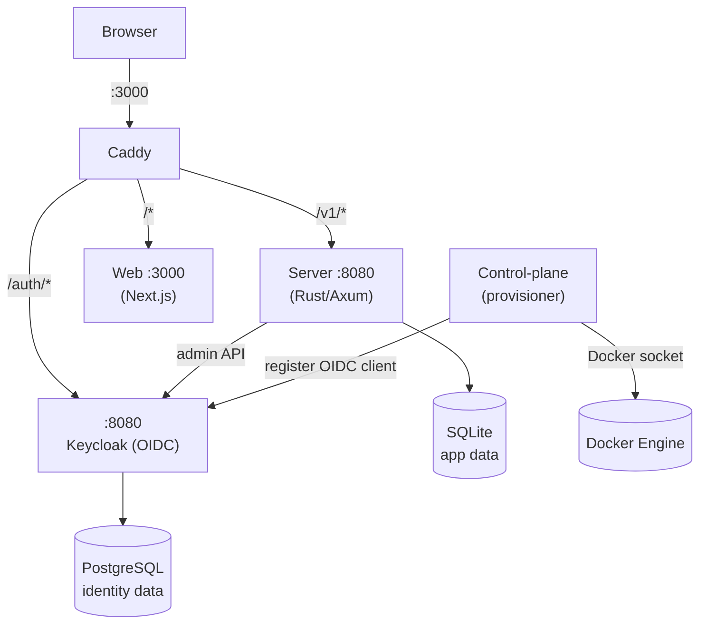

# Keasy

Federated workspace management platform — connect data, build catalogs, share datasets.

Built with Rust, Next.js, Keycloak, and Docker.

## Prerequisites

- [Docker](https://docs.docker.com/get-docker/) with Compose v2
- 8 GB RAM recommended (Keycloak + Rust compilation)

## Quick Start

```bash
git clone <repo-url> && cd keasy
make setup        # creates .env, builds images, starts everything
```

Open [http://localhost:3000](http://localhost:3000) — you'll be redirected to Keycloak login.

## Demo Credentials

The Keycloak realm import ships two demo users:

| Email | Password | Role |
|-------|----------|------|
| `owner@keasy.dev` | `owner` | Owner |
| `member@keasy.dev` | `member` | Member |

## Workspace Bootstrap

There are no SQL seeds. A workspace exists if and only if the **control-plane**
provisioner created it (`POST /workspaces { name, owner_keycloak_sub }`), which
registers the OIDC client in the shared Keycloak and brings up the instance
stack. Each instance, at boot, idempotently ensures the `owner` membership of
the `KEASY_OWNER_KEYCLOAK_SUB` it receives via config — the single bootstrap
datum. In dev, `make dev` pins the demo owner's Keycloak `sub` so the instance
self-provisions its owner; everything else starts empty.

## Architecture


```mermaid
graph TD
    Browser -->|":3000"| Caddy

    Caddy -->|"/v1/*"| Server["Server :8080<br/>(Rust/Axum)"]
    Caddy -->|"/auth/*"| Keycloak[":8080<br/>Keycloak (OIDC)"]
    Caddy -->|"/*"| Web["Web :3000<br/>(Next.js)"]

    Server --> SQLite[(SQLite<br/>app data)]
    Server -->|"admin API"| Keycloak

    ControlPlane["Control-plane<br/>(provisioner)"] -->|"Docker socket"| Docker[("Docker Engine")]
    ControlPlane -->|"register OIDC client"| Keycloak

    Keycloak --> PostgreSQL[(PostgreSQL<br/>identity data)]
```

## Tech Stack

| Component | Technology |
|-----------|-----------|
| Frontend | Next.js, React, shadcn/ui, TailwindCSS |
| Backend | Rust, Axum, SQLite |
| Identity | Keycloak (OIDC) |
| Reverse Proxy | Caddy |

## Development

```bash
make dev              # start dev environment with hot reload
make logs-server      # tail server logs
make logs-web         # tail web logs
make shell-server     # interactive shell in server container
make shell-web        # interactive shell in web container
```

- Editing `web/src/` triggers instant HMR in the browser
- Editing `server/src/` triggers cargo-watch recompilation and server restart

## Optional MinIO

The environment can be complemented with MinIO, an object storage service compatible with the Amazon S3 API. This integration makes it possible to reproduce the behaviour of an S3 bucket locally and to validate cloud accounts, connections and pipelines without depending on credentials, quotas or services provided by an external cloud platform.

MinIO can be deployed manually as a standalone service or through the optional overlay included in the project.

MinIO is not part of the base deployment: the base deployment does not include the `minio` or `minio-init` services. Its installation is documented as a later, optional procedure.

MinIO provides a local object storage service compatible with the S3 API. Its purpose in this environment is to allow creating buckets and running integration tests against S3-compatible data sources without depending on an account, subscription or infrastructure belonging to a cloud provider.

The integration makes it possible to validate locally:

* S3 credential configuration.
* Bucket access.
* Listing and reading objects.
* Creating cloud connections in Keasy.
* Running pipelines over files stored behind an S3-compatible API.

MinIO can be integrated through one of the following procedures:

* Manual deployment as a standalone container.
* Managed deployment through `make setup-minio`.

Both procedures use ports `9000` and `9001`, so they must not run at the same time.

### Option A: manual MinIO deployment

#### 1. Check the Keasy network

Once Keasy is running, inspect the network created by Docker Compose:

```bash
docker network inspect keasy_default
```

The name derives from:

```text
<COMPOSE_PROJECT_NAME>_default
```

If a different project name has been configured, find the network with:

```bash
docker network ls --format "{{.Name}}" | grep _default
```

The MinIO container must be attached to the same network as the `server` service.

#### 2. Define the credentials

In Git Bash:

```bash
export KEASY_MINIO_USER="minioadmin"
export KEASY_MINIO_PASSWORD="replace-with-local-password"
```

The password must be at least eight characters long. These values will be used later to configure the cloud account in Keasy.

#### 3. Create the volume and the container

```bash
docker volume create keasy-minio-data

MSYS_NO_PATHCONV=1 docker run -d \
--name minio-local \
--network keasy_default \
--network-alias minio.localtest.me \
-p 127.0.0.1:9000:9000 \
-p 127.0.0.1:9001:9001 \
-e MINIO_ROOT_USER="$KEASY_MINIO_USER" \
-e MINIO_ROOT_PASSWORD="$KEASY_MINIO_PASSWORD" \
-v keasy-minio-data:/data \
quay.io/minio/minio:RELEASE.2025-09-07T16-13-09Z \
server /data --console-address ":9001"
```

`MSYS_NO_PATHCONV=1` prevents Git Bash from converting `/data` into a Windows path. On Linux the prefix can be omitted. In PowerShell, the variable definitions and line continuations must be adapted to its syntax.

Check the status:

```bash
docker ps --filter "name=minio-local"
docker logs minio-local
```

#### 4. Create the bucket

1. Open `http://localhost:9001`.
2. Enter the credentials defined above.
3. Create a bucket, for example `connector-test`.
4. Upload the files that will be used as data sources.

#### 5. Container lifecycle

```bash
docker stop minio-local
docker start minio-local
```

To remove the container without deleting the volume contents:

```bash
docker rm -f minio-local
```

To also delete the stored data:

```bash
docker volume rm keasy-minio-data
```

A manually deployed MinIO is not managed by the `make down` and `make clean` targets.

While `minio-local` is running, `make down` reports `Network keasy_default  Resource is still in use`: the network is kept because `minio-local` is still attached to it. This is expected. Remove `minio-local` first if the network should be removed too.

### Option B: managed MinIO deployment

The repository includes a Compose overlay that starts MinIO within the same project.

If Keasy is already running through `make dev`, there is no need to stop it. Run directly:

```bash
make setup-minio
```

Compose keeps the existing services and adds:

* `minio`
* `minio-init`

The following target can also be used during the development cycle:

```bash
make dev-minio
```

The variables used live in `.env`. If `.env` does not exist, `make dev`, `make dev-minio` and `make demo` create it from `.env.development`:

```dotenv
MINIO_ROOT_USER=keasytest
MINIO_ROOT_PASSWORD=KeasyTest2026Local
MINIO_DEFAULT_BUCKET=connector-test
```

This mode:

1. Starts MinIO.
2. Creates the `keasy_minio-data` volume.
3. Runs `minio-init`.
4. Creates the bucket configured in `MINIO_DEFAULT_BUCKET`.

Check the status:

```bash
make ps
make logs-minio
```

Expected results:

* `minio` keeps running and shows `(healthy)`: Compose checks `http://localhost:9000/minio/health/live` every 10 seconds.
* `minio-init` waits until `minio` is healthy, then exits with code `0` after creating the bucket.

The console is available at:

```text
http://localhost:9001
```

Default credentials:

```text
User: keasytest
Password: KeasyTest2026Local
```

### Preparing the data in MinIO

Before creating the connection in Keasy:

1. Open `http://localhost:9001`.
2. Log in with the credentials for the deployment mode in use.
3. Check that the `connector-test` bucket exists.
4. In manual mode, create it if it does not exist yet.
5. Upload at least one CSV, JSON, Parquet or image file to validate access from Keasy later.

### Configuring MinIO in Keasy

The cloud account and the data connection are created manually from the Keasy UI.

These operations belong to the data plane: any workspace user (owner or member) can perform them. Log in through the **Dev (Dex)** option, for example with the member test user:

```text
User: member@keasy.local
Password: password
```

#### 1. Create the cloud account

Go to:

```text
Settings → Cloud Accounts → Add account
```

Select **Amazon S3**.

##### Managed MinIO

| Field             | Value                |
| ----------------- | -------------------- |
| Name              | `Local MinIO`        |
| Access Key ID     | `keasytest`          |
| Secret Access Key | `KeasyTest2026Local` |
| Region            | `us-east-1`          |
| Endpoint URL      | `http://minio.localtest.me:9000` |

##### Manual MinIO

| Field             | Value                                     |
| ----------------- | ----------------------------------------- |
| Name              | `Local MinIO`                             |
| Access Key ID     | User defined in `KEASY_MINIO_USER`        |
| Secret Access Key | Password defined in `KEASY_MINIO_PASSWORD` |
| Region            | `us-east-1`                               |
| Endpoint URL      | `http://minio.localtest.me:9000`          |

Save the cloud account before creating the connection.

Both modes use the same endpoint, `http://minio.localtest.me:9000`. Some jobs run in the browser: the server signs the URL and the browser fetches it, so the endpoint name must resolve on both sides. `*.localtest.me` resolves to `127.0.0.1` on the host, and the network alias (declared in `docker-compose.minio.yml` for the managed mode, and with `--network-alias` for the manual container) makes the same name resolve to MinIO inside the Docker network. `localhost:9000` only works from the host, and `minio:9000` / `minio-local:9000` only inside the Docker network: with them the connection validates, but browser-executed jobs fail with `Failed to fetch`.

Clear-text `http://` endpoints are accepted only by debug builds of the server (`make dev`, `make dev-minio`, `make test-minio`). Release builds (`make demo`, `make prod` and the production image) refuse them, so production always talks TLS and MinIO over `http://` does not work there.

The value of `COMPOSE_PROJECT_NAME` does not change this endpoint:

```text
Managed MinIO: http://minio.localtest.me:9000
Manual MinIO: http://minio.localtest.me:9000
```

#### 2. Create the data connection

Go to:

```text
Connections → Create connection
```

Fill in the form:

| Field         | Value                  |
| ------------- | ---------------------- |
| Name          | `minio-test-data`      |
| Type          | `Data`                 |
| Location      | `Cloud`                |
| Cloud Account | `Local MinIO`          |
| URL           | `connector-test/`      |

The URL field already shows the `s3://` prefix, so enter only the bucket:

```text
connector-test/
```

Do not add a second `s3://` prefix. To connect a specific folder of the bucket, enter `connector-test/folder/`.

#### 3. Validate the connection

Open the connection from the Connections list: Keasy lists the bucket contents under **Files**.

If the configuration is correct:

1. The connection appears in the Connections list.
2. The files uploaded to MinIO are listed under **Files**.
3. The connection can be used in Fossil references.

Example:

```text
@minio-test-data/file.csv
```

The identifier used in the reference is the value entered in the connection's `Name` field.

### Testing the connection from the server

With the managed mode running (`make setup-minio` or `make dev-minio`), run:

```bash
make test-minio
```

It runs the `cloud::reader::tests::round_trips_an_object_through_minio` test inside the `server` container, using the same storage functions as Keasy's connections. The test writes a small object under `keasy-connectivity-test/` in the bucket, lists it, reads it back, compares the bytes and deletes it.

Expected result:

```text
✓ MinIO round trip: s3://connector-test/keasy-connectivity-test/<uuid>.csv written, listed, read back and deleted
test result: ok. 1 passed
```

The endpoint, credentials and bucket come from `.env.test`. The test is marked `#[ignore]` because it needs a running MinIO, so a plain `cargo test` (and CI) skips it; it only runs through `make test-minio`.

Limitations:

* It is meant for the managed mode and its default credentials.
* It covers the server storage layer only, not the HTTP API or the browser path used by jobs.
* If a step fails midway, the object stays in the bucket under `keasy-connectivity-test/`. Delete it from the console at `http://localhost:9001`.

### MinIO troubleshooting

#### Port `9000` is already in use

Identify the container that publishes the port:

```bash
docker ps --filter "publish=9000" \
--format "table {{.ID}}\t{{.Names}}\t{{.Ports}}"
```

Stop or remove the previous container before starting another MinIO instance:

```bash
docker rm -f CONTAINER_NAME
```

#### Keasy cannot reach MinIO

For the managed mode, check:

* The `minio` status with `make ps`.
* That `minio-init` finished successfully.
* The endpoint `http://minio.localtest.me:9000`.
* The credentials defined in `.env`.
* That the bucket exists at `http://localhost:9001`.

Logs:

```bash
make logs-minio
make logs-server
```

For the manual mode, check that both containers share a network:

```bash
docker inspect minio-local \
--format '{{range $name, $config := .NetworkSettings.Networks}}{{$name}}{{"\n"}}{{end}}'
```

The output must include:

```text
keasy_default
```

## Make Targets

| Target | Description |
|--------|-------------|
| `make help` | Show all available targets |
| `make setup` | First-time setup: create .env, build, start |
| `make dev` | Start dev environment (hot reload + demo data) |
| `make setup-minio` | Add managed MinIO and create the initial bucket |
| `make dev-minio` | Dev environment with managed MinIO |
| `make down` | Stop all services |
| `make prod` | Start with production builds (local test) |
| `make build` | Build production images without starting |
| `make logs` | Tail all service logs |
| `make logs-<svc>` | Tail logs for one service |
| `make logs-minio` | Managed MinIO logs |
| `make restart` | Restart all services |
| `make restart-<svc>` | Restart one service |
| `make clean` | Nuclear reset: remove containers, volumes, images |
| `make shell-<svc>` | Open shell in container |
| `make ps` | Show running services |
| `make minio-bucket` | Create the managed MinIO bucket |
| `make test-minio` | Run the MinIO connectivity test (needs `make dev-minio` running) |

`make down` keeps the volumes. `make clean` deletes the data and caches managed by the project's Compose files.

A manually created MinIO container is managed with the Docker commands shown in its section.

## Project Structure

```
keasy/
├── infra/                          # Infrastructure configs
│   ├── caddy/Caddyfile             #   reverse proxy routing
│   ├── keycloak/realm-import/      #   OIDC realm + demo users
├── keycloak/                       # keasy-keycloak — shared Keycloak admin client
├── control-plane/                  # workspace provisioner (Docker API + Keycloak)
├── server/                         # Rust API server
│   ├── Dockerfile                  #   production (multi-stage, slim)
│   ├── Dockerfile.dev              #   development (cargo-watch)
│   └── src/
├── web/                            # Next.js frontend
│   ├── Dockerfile                  #   production (standalone)
│   ├── Dockerfile.dev              #   development (HMR)
│   └── src/
├── docker-compose.yml              # Base: all services, shared config
├── docker-compose.dev.yml          # Dev overlay: hot reload, seed
├── docker-compose.prod.yml         # Prod overlay: optimized builds
├── Makefile                        # Task runner
└── .env.example                    # Environment template
```

## OpenAPI Pipeline

The server is the single source of truth for the API schema. It exposes `GET /openapi.json` at runtime, generated from `#[utoipa]` annotations in Rust. The frontend consumes this to produce typed client code.

```
server (utoipa annotations)
  → GET /openapi.json          # served by the running server
  → openapi.json               # committed at repo root
  → npm run openapi            # generates web/src/lib/api/schema.d.ts
  → openapi-fetch client       # fully typed API calls in the frontend
```

To regenerate after changing server endpoints:

```bash
# 1. With the server running (make dev):
curl -s http://localhost:3000/v1/openapi.json | jq . > openapi.json

# 2. Regenerate TypeScript types:
cd web && npm run openapi
```

## Docker Compose Layering

The compose setup uses a base + overlay pattern:

- **`docker-compose.yml`** — defines all services, networks, volumes, and shared environment. Never used alone.
- **`docker-compose.dev.yml`** — adds hot reload (cargo-watch, Next.js HMR), dev seed data, relaxed healthchecks, and volume mounts for source code.
- **`docker-compose.prod.yml`** — uses optimized multi-stage builds, no seed data, and strict healthchecks.
- **`docker-compose.minio.yml`** — optional, development only: adds the `minio` and `minio-init` services on top of the dev overlay (see [Optional MinIO](#optional-minio)). It is never combined with `docker-compose.prod.yml`.

```bash
# Dev (via Makefile)
make dev

# Dev with managed MinIO (via Makefile)
make dev-minio

# Production (via Makefile)
make prod

# Manual
docker compose -f docker-compose.yml -f docker-compose.dev.yml up --build
docker compose -f docker-compose.yml -f docker-compose.dev.yml -f docker-compose.minio.yml up --build
docker compose -f docker-compose.yml -f docker-compose.prod.yml up --build
```

## Environment Variables

| Variable | Description | Default |
|----------|-------------|---------|
| `KEASY_SECRET_KEY` | Encryption key for stored secrets | `change-me-in-production` |
| `KC_DB_PASSWORD` | Keycloak PostgreSQL password | `changeme` |
| `KC_ADMIN_PASSWORD` | Keycloak admin console password | `changeme` |
| `KEASY_OIDC_CLIENT_SECRET` | OIDC client secret (shared with Keycloak) | `keasy-dev-secret` |
| `MINIO_ROOT_USER` | Managed MinIO root user (development only) | `keasytest` |
| `MINIO_ROOT_PASSWORD` | Managed MinIO root password (development only) | `KeasyTest2026Local` |
| `MINIO_DEFAULT_BUCKET` | Bucket created by `minio-init` (development only) | `connector-test` |

Environment files:

- **`.env.example`** — documents every variable.
- **`.env.development`** — development defaults. `make dev`, `make dev-minio` and `make demo` copy it to `.env` when `.env` does not exist.
- **`.env.test`** — values for the MinIO connectivity test (`make test-minio`): endpoint, credentials and bucket of the managed MinIO. Local, throwaway credentials only.

## Production

Test production builds locally:

```bash
make prod         # build and run production images
make build        # build images without starting
```

## Troubleshooting

| Problem | Solution |
|---------|----------|
| Keycloak slow to start | Wait for healthcheck (up to 60s on first start) |
| Server compilation slow | First Rust build caches deps (~2-5 min), subsequent builds are fast |
| Hot reload not working | Check volume mounts; try `make restart-web` or `make restart-server` |
| Port 3000 in use | Run `make down` first, or change port in docker-compose.yml |
| Database issues | Run `make clean && make dev` to wipe and re-create demo data |
