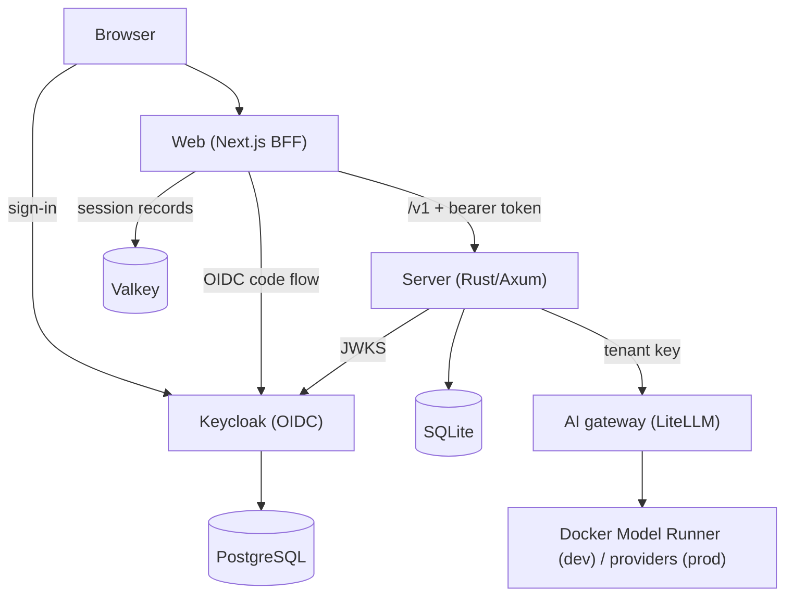

# Keasy

Federated workspace management platform — connect data, build catalogs, share datasets.

## Quick start

Needs Docker with Compose v2 and ~8 GB RAM (Keycloak + the first Rust compile).

```bash
make dev
```

Open [http://localhost:3000](http://localhost:3000) and log in at Keycloak. The first
`up` compiles the server's dependencies once; later ones reuse the cached volumes.
No `.env`: every dev value is a literal in `docker-compose.yml`.

| What | Where |
|------|-------|
| App (web BFF, `/api/v1`) | [http://localhost:3000](http://localhost:3000) |
| Keycloak | [http://keycloak.localhost:8180](http://keycloak.localhost:8180) (admin `admin` / `admin`) |
| API, for curl | `http://localhost:8080` |
| AI gateway console | [http://localhost:4000/ui](http://localhost:4000/ui) (`admin` / `sk-dev-master-key`) |

AI runs on local models served by Docker Model Runner (Docker Desktop 4.40+,
`docker desktop enable model-runner`): native on the host, on the Mac's GPU. The first `up`
pulls them; until then everything but AI works.

## Dev accounts

Two accounts, because the planes are disjoint: an owner administers members,
identity and the catalog and has no data plane; a member runs jobs, holds the
connections and opens Discovery, and administers nothing.

| Email | Password | Role | What it reaches |
|-------|----------|------|-----------------|
| `dev@keasy.local` | `password` | Member | Jobs, connections, Discovery, AI |
| `owner@keasy.local` | `password` | Owner | Members, identity, catalog |

Both are declared in `infra/terraform/realm/dev.tfvars` (`tenants`,
`dev_user_password`). Dev has no upstream IdP; prod has no passwords, only SSO.

## Dev data

`make dev` also brings up an S3 store, dev-only: [SeaweedFS](https://github.com/seaweedfs/seaweedfs),
configured by `infra/dev/seaweedfs/` (its keys in `s3.json`, and in `iam.json` the role
the server assumes to vend a credential scoped to one prefix). It has no console.

| What | Where |
|------|-------|
| S3 API (and STS) | `http://s3.localhost:9000` (and `http://localhost:9000`) |
| Credentials | `keasy-admin` / `keasy-admin-secret` |
| Bucket | `keasy-dev`, seeded from `infra/dev/seed/` on every `up` |

The dev graph is the [LDBC Social Network Benchmark](https://ldbcouncil.org/benchmarks/snb/)
at scale factor 0.1 — the official Interactive v1 `CsvCompositeMergeForeign` archive
(about 17 MB compressed, 59 MB of CSV: 1.5k people, 136k posts, 151k comments). It is
not in git; fetch it once, before `make dev`:

```bash
make seed   # downloads, checks the SHA-256, unpacks into infra/dev/seed/ldbc/
```

Without it the bucket holds the shapes alone and `s3-init` says to run `make seed`.
The end-to-end suite does not need it: `s3-init` also mirrors the suite's own
fixtures (`e2e/fixtures/`, a small shop: people, orders and `shop.shex`) to `e2e/`,
and the suite declares its connections over them (**E2E source**, **E2E shapes**) as
it signs in.

At boot the instance declares, over that bucket, the **LDBC SNB** source connection
(`ldbc/`), the **Dev shapes** vocabulary connection (`vocab/`, holding
`snb.shex`) and the sink (`output/`). Access is proved before each connection row is
written, and an existing sink is never overwritten. `infra/dev/snb.fossil` is a
program over them: paste it into the studio to map SF0.1 into `output/`.

`s3.localhost` and `keycloak.localhost` are load-bearing: Docker's DNS answers
them inside the compose network and `*.localhost` is loopback on the host, so the
endpoint a vended credential names, and the issuer a token names, work from both sides.

## Architecture


```mermaid
graph TD
    Browser --> Web["Web (Next.js BFF)"]
    Browser -->|"sign-in"| Keycloak["Keycloak (OIDC)"]
    Web -->|"/v1 + bearer token"| Server["Server (Rust/Axum)"]
    Web -->|"OIDC code flow"| Keycloak
    Web -->|"session records"| Valkey[("Valkey")]
    Server -->|"JWKS"| Keycloak
    Server --> SQLite[("SQLite")]
    Server -->|"tenant key"| Gateway["AI gateway (LiteLLM)"]
    Gateway --> Models["Docker Model Runner (dev) / providers (prod)"]
    Keycloak --> PostgreSQL[("PostgreSQL")]
```

Authentication is a Backend For Frontend. The **web** is the OIDC relying party
(`@kanzo-tech/auth/next`, mounted at `/api/auth`): it holds the confidential
client, keeps the tokens in Valkey (`KEASY_SESSION_STORE_URL`), and gives the
browser a sealed cookie carrying only the ticket to them.
The **server** is a resource server: it validates the bearer token against the
realm's JWKS (`iss`, `aud`, `exp`, `azp`, signature) and holds no client secret,
no session and no cookie. It is reached only through the web's `/api/v1`.

Mappings run in the browser (DuckDB-WASM + `@fossil-lang/*`), and so does source
introspection; the server hosts connections, vends credentials scoped to one prefix, jobs and the catalog,
and never reads a data file. Every job names a sink as its destination and is
visible only to the member who created it.

Models are not a credential. Every call goes to the platform's **AI gateway**
under an alias (`chat`, `complete`) with the workspace's own key, which
only the server holds (`KEASY_AI_URL`, `KEASY_AI_KEY[_FILE]`). Budgets, upstreams and
the dev/prod switch live in the gateway — see [`infra/ai/README.md`](infra/ai/README.md).

A **credential** (S3 or Azure) is who keasy is when it reaches a store; a
**connection** puts one to use (a storage prefix — a source or the one sink). Both
are validated on every write,
and a credential in use cannot be deleted. `KEASY_BOOTSTRAP_FILE` declares them at
boot in the API's own request format (dev: `infra/dev/bootstrap.json`).

An instance's look is declared, not edited: `KEASY_BRANDING_FILE` names a YAML
file holding exactly what kanzo-ui's theme generator exports (`branding:` with
`theme_css`, `families`, `default`, `lock`, and optionally `logo`), validated at
boot and served publicly at `GET /v1/branding`. Without it every shipped theme is
offered. Example: `infra/dev/branding.example.yml`; in prod, a tenant's `branding_file`.

Stored credentials are sealed with `KEASY_SECRET_KEY`: 32 random bytes in base64
(`openssl rand -base64 32`). The server refuses to start without one, and refuses
a database whose schema is not the one it ships — there are no migrations; wipe
the volume (`make clean`) instead.

## Deployment

Docker Swarm, driven by Terraform — see [`infra/terraform/README.md`](infra/terraform/README.md).
`make deploy-platform` brings up Traefik, Keycloak (on its own host), Postgres and the AI gateway;
`make deploy-realm` applies the realm and one server + web + Valkey stack per tenant
declared in `realm/terraform.tfvars`. Images are published to GHCR by
`.github/workflows/images.yml` on `v*` tags, after the server and web CI pass.

## Development

| Target | What it does |
|--------|--------------|
| `make dev` | Start dev; rebuild only after dep or Dockerfile changes (code hot-reloads) |
| `make down` | Stop everything |
| `make clean` | Remove containers, volumes (Keycloak, dev realm state, data) and images |
| `make logs` / `make logs-<svc>` | Tail logs |
| `make restart` / `make restart-<svc>` | Restart without rebuilding |
| `make shell-<svc>` | Shell in a container |
| `make e2e` | The failure scenarios (`e2e/`, Playwright) against the stack without models (`e2e/compose.yml`, as CI); main checkout only, as Keycloak admits :3000 alone |

`docker-compose.yml` is the dev stack and nothing else. Dev applies the same
`infra/terraform/realm` module as prod, with `dev.tfvars`.
The Rust toolchain is pinned once, in `server/rust-toolchain.toml`.

## API contract

The wire types live next to what they describe in `server/src`; each route
module's `router()` is both its routes and their spec. `api/` (`@keasy/api`) holds
the committed `openapi.json`, the types generated from it and the client the web
uses. `server/tests/api/openapi.rs` is a golden test of `openapi.json`, so
`cargo test` (and CI) fails when it is stale.

```bash
make api   # UPDATE_EXPECT=1 cargo test --test api openapi, then pnpm generate
```

## Layout

```
api/                @keasy/api: the committed spec, its generated types and the client
e2e/                @keasy/e2e: one Playwright test per failure scenario, its fixtures, and the `faults` profile's servers
infra/dev/          the S3 store's config and seed, and an example program, dev-only
infra/terraform/    platform/ and realm/ — the Swarm deployment, and dev's realm
server/             Rust API (Dockerfile = release, Dockerfile.dev = cargo-watch)
  src/main.rs       configures from the environment and serves
  src/startup.rs    Application, AppState, the router and the spec it publishes
  src/routes/       one file per resource: handlers with their bodies
  src/domain/       the records and parse-don't-validate types
  src/{credentials,connections,jobs}/  persistence and shared behaviour
  tests/api/        black-box HTTP tests through spawn_app, and the spec golden
web/                Next.js app and BFF (Dockerfile = release, Dockerfile.dev = HMR)
```
